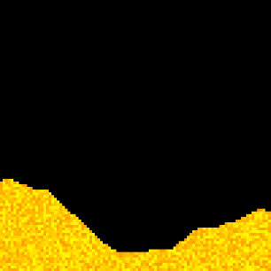

# moonsbox



A sandbox cellular automata playground written in Python with Pygame. Inspired by classic falling 
sand games, especially SmellyMoo's sand:box, moonsbox lets you experiment with different materials
and their interactions in a pixel world.

## Features

- **Material palette**: Choose materials with a visual palette (keyboard/mouse navigation supported)
- **Heat simulation**: Materials exchange temperature based on heat capacity and 
                       thermal conductivity
- **Sound effects**: Some materials can play sounds on interaction
- **Resizable window**: The simulation area and camera can be zoomed and panned
- **Saving & Screenshot**: Share some funny situations with your friends using saves or screenshots
- **Highly customizable**: Tune your sandbox changing TOML config or assets

## Plans

- Move const.py to a config file. (✓)
- Get rid of tkinter.filedialog dependency and make our own opener of native file dialog. (✓)
- Make capturing system for the game on top of FFMPEG. (✓)
- Make the first release of the game. (✓)
- Spread the game. (✓)
- Create a chat for the game. (✓)
- Rewrite high-loaded core of the game in C++ (branch wip-cxx)
- Add more materials
- Add visual configuring
- Create a launcher for the game with visual configuring, managing saves and captures, game updating
- Add touchscreen support
- Add building chain for Android
- Make multiplayer prototype

## Controls

- **LMB | Ctrl**: Draw with the selected material
- **RMB | Shift**: Move the camera
- **Mouse Wheel**: Zoom camera
- **MMB | Tab**: Open the material palette
- **Space**: Pause simulation
- **V**: Change render mask (normal/thermal)
- **F5**: Step simulation
- **F6**: Clean map
- **F10**: Take map snapshot
- **+ | - | Alt + Mouse Wheel**: Change brush size
- **R**: Pause rendering to speed up simulation
- **Alt + F12**: Begin or end capturing (see Running to convert capture to a video)
- **U | Mouse Go Forward**: Push current material into material stack
- **I | Mouse Go Back**: Pop material from the stack (if empty, get Space)
- **K**: Pick the material of a dot under the mouse cursor

## Social

Moonsbox have got its own [telegram channel](https://t.me/kk_moonsbox)!

If you know Russian and you are interested in the development of moonsbox, please join it.

## Requirements

- Python 3 (I run it with Python 3.13.3)
- pygame-ce
- numpy
- toml

## Running

```sh
# If your platform is not Windows, it's recommended to have tkinter:
python -c "import tkinter" # checks if tkinter is here
# If you don't have one and not using Windows, then if you open file dialogs, you have to enter
# text into console.

# Getting ready
python -m pip install pygame-ce numpy toml
cd <PROJECT DIR>

# Settings are at ./user/config.toml
notepad user\config.toml # if you have Windows
nano user/config.toml # if you have GNU nano

# Running
python -m src

# Converting a capture to a video
# Requires FFMPEG!
ffmpeg -i <CAPTURE DIR>/frame_%06d.png [<further args>]
# Create a video with 60 FPS, x264 codec, scaled to 400x400 (but still pixelated):
ffmpeg -i capture_2025-08-05_17-02-33/frame_%06d.png -framerate 60 -vcodec libx264 \
       -sws_flags neighbor -s 400x400 testcapt.mp4
```

## License

This project is licensed under the GPL-3.0 License - see the [LICENSE](LICENSE) file for details.
