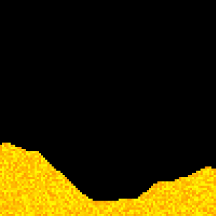

# moonsbox



A falling sand game written in C++ with SDL2. 
Inspired by established falling sand games, 
moonsbox lets you experiment with different materials
and their interactions in a 2D grid world with great performance.

The main inspiration for moonsbox is [sand:box](https://smellymoo.com/) by smellymoo, along with 
[Sandboxels](https://sandboxels.r74n.com/), 
[Powder Game](https://play.google.com/store/apps/details?id=jp.danball.powdergameviewer) and 
[The Powder Toy](https://powdertoy.co.uk/).

## Features

- **Material palette**: Choose materials with a visual palette (keyboard/mouse navigation supported)
- **Heat simulation**: Materials exchange temperature based on heat capacity and 
                       thermal conductivity
- **Sound effects**: Some materials can play sounds on interaction
- **Advanced renderer**: Zoom and heatmap display are supported
- **Saving system**: Save your progress, share your buildings, schemes or silly states
- **Standalone simulation**: Simulation can be run headless. There is Python API to simulation.
                             You can make a frontend for any platform

## Controls

| Action                                            | Control                |
|:--------------------------------------------------|:-----------------------|
| Draw with the selected material                   | LMB, Ctrl              |
| Move the camera                                   | RMB, Shift             |
| Zoom camera                                       | Mouse Wheel            |
| Open the material palette                         | MMB, Tab               |
| Pause simulation                                  | Space                  |
| Change render mask (normal/thermal)               | V                      |
| Step simulation                                   | F5                     |
| Clean map                                         | F6                     |
| Change brush size                                 | Alt + Mouse Wheel, +/- |
| Push current material into material stack         | U, Mouse Go Forward    |
| Pop material from the stack (if empty, get Space) | I, Mouse Go Back       |

## Social

Join our community!

- For English speakers, come chat with us on [discord server](https://discord.gg/ZKDg6KHqyQ).
- Если вы знаете русский, подписывайтесь на наш [телеграм канал](https://t.me/kk_moonsbox).
  Новости там появляются быстрее, чем в дискорде.
  (Telegram channel. News appear there faster.)

## Dependencies

### moonsbox

- C++23
- CMake 3.20+
- SDL2 (including SDL_ttf, SDL_image)
- SDL2_gfx
- minizip
- SDL2pp
- miniaudio (embedded)
- portable-file-dialogs (embedded)

### simulationengine

- C++23
- CMake 3.20+
- minizip (may be disabled)
- pybind11 (optional, for Python API)

## Building and Running

```sh
# Install dependencies (Arch Linux)
# Common
sudo pacman -S base-devel cmake gcc
# simulationengine optionals
sudo pacman -S minizip pybind11
# moonsbox
sudo pacman -S sdl3 sdl2-compat sdl2_image sdl2_ttf sdl2_gfx minizip
yay -S sdl2pp

# Build
git clone https://github.com/KlasterK/moonsbox.git
cd moonsbox
cmake -S. -Bbuild -DCMAKE_BUILD_TYPE=Release
nano build/CMakeCache.txt # configure if needed
cmake --build build

# Run the game
build/moonsbox/moonsbox

# Run Python and load simulationengine Python API
PYTHONPATH=$PYTHONPATH:build/simulationengine python
# In opened REPL:
# >>> import pysimulationengine
```

## License

This project is licensed under the GPL-3.0 License - see the [LICENSE](LICENSE) file for details.
